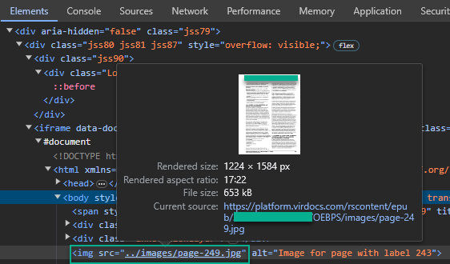

# RedShelf Virdocs - Bypass protection PDF Download

In the web platform "**RedShelf Virdocs**" you are allowed to print in PDF your ePub/eReader documents, but sometimes contributors do not allow downloading and printing to avoid possible leaks or third party distributions not allowed.

This python script allows us to "bypass" this protection and download ePub/eReader documents and export them to PDF format. First all pages are downloaded in jpg image format, resized to A4 size and finally a PDF document output is generated.

### Requirements
```python
pip install requests
pip install reportlab
```

### Get URL ePub/eReader images
Inside the RedShelf Virdocs ePub/eReader viewer. We inspect the web and look for the iframe corresponding to the current page, in the body we will see a div containing the internal URL inside an img src tag. There we can copy the absolute path and substitute it in the variable "url_base".



### Variables
- Indicates the directory where the jpg images will be saved and the name of the exported PDF file.
- Replace XXXXXXX with the value of the URL.
- Replace the numpag variable with the number of jpg URL pages contained in the document.
```python
target_directory_img = "TARGET_DIRECTORY_IMG"
base_url = "https://platform.virdocs.com/rscontent/epub/XXXXXXX/XXXXXXX/OEBPS/images/page-{}.jpg"
pdf_file = "EXPORT_PDF_FILE.pdf"
numpag = 350
```

### Cookies
Replace session cookie settings. Use any browser addon for editing and exporting cookies.
```json
{
    "session_id": "value1",
    "csrftoken": "value2"
}
```

### Usage
```python
python3 RedShelf-Bypass-PDFDownload.py
```