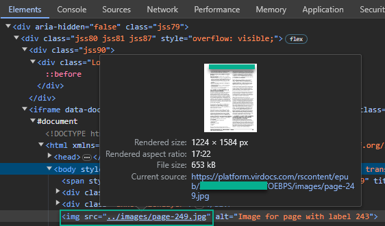
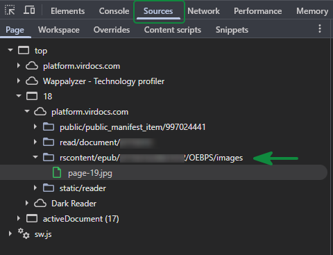
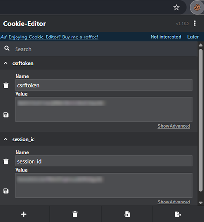
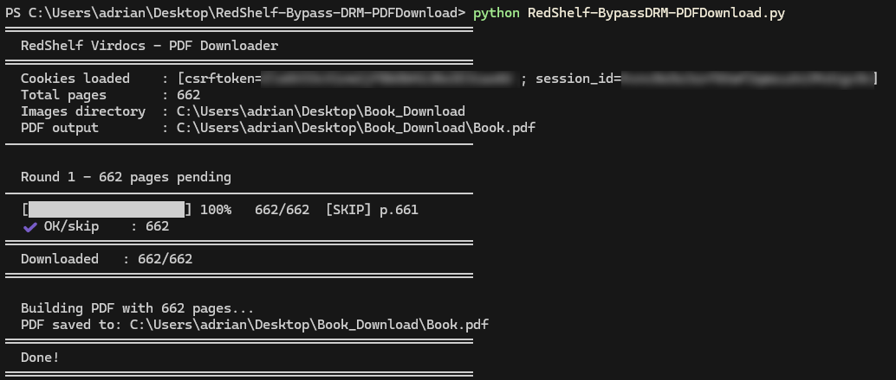

# RedShelf Virdocs - Bypass DRM protection PDF Download

In the web platform "**RedShelf Virdocs**" you are allowed to print in PDF your ePub/eReader documents, but sometimes the contributors or owners add DRM (Digital Rights Management) protection to prevent the downloading and printing of these eBooks to avoid possible leaks or unauthorized third party distributions.

This python script downloads all pages as JPG images and builds a PDF from them. It handles Cloudflare-cached 401 blocks automatically, when detected, it computes the exact TTL from response headers and waits with a live countdown before retrying.

> [!NOTE]
> **This is not a vulnerability or anything illegitimate**, simply a use of how these eBooks published on this platform are being offered. Although the direct download or print functionality is not allowed for some eBooks by the contributor or owner, it is possible to "download" them through the image format exposed in the web source, accessible to any previously authenticated user on the platform.

### Requirements
```
pip install requests img2pdf
```

### Get URL and page count

The URL contains two book-specific IDs (`/epub/XXXXXXX/XXXXXXX/OEBPS`) that must be replaced with the actual values from the book. The `{}` placeholder replaces the page number.

**Option 1**: Inside the RedShelf Virdocs ePub/eReader viewer, open DevTools (F12 > Elements) and navigate to the `iframe > body` section. Find a `div` referencing a page image in JPG format and copy the URL. 



**Option 2**: Open DevTools (F12 > Sources > Pages), navigate to `platform.virdocs.com` and find the reference to the page JPG image.



### Configuration

Edit `config.json` (do not modify the script):

```json
{
    "target_directory_img": "PATH/TO/OUTPUT/FOLDER",
    "base_url": "https://platform.virdocs.com/rscontent/epub/XXXXXXX/XXXXXXX/OEBPS/images/page-{}.jpg",
    "numpag": 350,
    "pdf_filename": "OUTPUT.pdf",
    "max_workers": 8,
    "max_retry_rounds": 5,
    "cf_wait_buffer": 15
}
```

`numpag` is the total URL page count, which may be higher than the books printed page count, the difference is front matter (cover, index, copyright, etc.).

### Cookies

Copy cookies for "platform.virdocs.com" using any browser extension **while the book is open in the reader**. Update the values of `session_id` and `csrftoken` in `cookies.json`.

> [!TIP]
> The `session_id` cookie expires when the browser is closed — always export fresh cookies with the book open.

> [!WARNING]
> **Cloudflare TTL:** invalid cookies cause Cloudflare to cache 401 responses for 30 minutes. The script detects the TTL, waits it out, and retries automatically.



### Usage
```
python RedShelf-BypassDRM-PDFDownload.py
```

**The script skips already-downloaded pages**, so it can be safely re-run to resume interrupted downloads.



### See also (Alternative spine-based download)

Alternative approach using the spine URL to fetch each page as full HTML and convert it to PDF via [wkhtmltopdf](https://wkhtmltopdf.org/).

- Erikas Taroza: https://github.com/erikas-taroza/redshelf_downloader

```
https://platform.virdocs.com/spine/XXXXXXX/{}
```

---

### Disclaimer

This script is intended for personal use only, with content you have legitimate access to. I am not responsible for any misuse, copyright infringement, or unauthorized distribution resulting from its use.